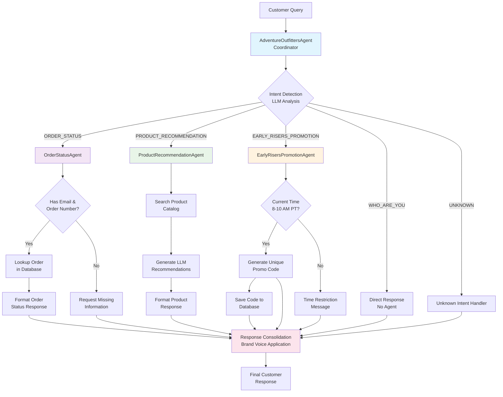

# Adventure Outfitters Customer Service Agent 🏔️

An intelligent customer service agent for Adventure Outfitters, an outdoor retail company. This agent uses an agentic workflow pattern to handle customer inquiries about order status, product recommendations, and promotions with clean, maintainable code.

## Features

🎒 **Order Status & Tracking** - Check order status using email and order number  
🏔️ **Product Recommendations** - Get personalized outdoor gear suggestions  
🌅 **Early Risers Promotion** - 10% discount codes (8-10 AM Pacific Time)  
❓ **General Inquiries** - Company information, policies, and support  
🔧 **Clean Architecture** - Simplified, maintainable codebase with minimal over-engineering

## Agent Architecture & Flow



## System Architecture

The system follows a **semantic router pattern** with:

### **Core Components**

- **Coordinator Agent** (`AdventureOutfittersAgent`) - Routes queries based on intent detection
- **Specialized Delegates**:
  - `OrderStatusAgent` - Handles order lookups and tracking
  - `ProductRecommendationAgent` - Provides product suggestions
  - `EarlyRisersPromotionAgent` - Manages time-based promotions
- **Support Systems**:
  - `TemplateManager` - Simplified template loading (schema-free)
  - `ConversationMemory` - Maintains conversation context
  - `StateManager` - Manages agent-specific state
  - `LLMAdapter` - Pluggable LLM provider interface (OpenAI/Gemini)

### **Decision Flow**

1. **Intent Detection**: LLM analyzes customer query to determine intent
2. **Agent Routing**: Coordinator routes to appropriate specialist agent
3. **Processing**: Specialist agent handles the specific business logic
4. **Consolidation**: Response is enhanced with Adventure Outfitters brand voice
5. **Delivery**: Final response sent to customer

## Quick Start

### 1. Setup Environment

```bash
# Navigate to project
cd adventure_outfitters_agent

# Create and activate virtual environment
python -m venv .venv
source .venv/bin/activate  # On Windows: .venv\Scripts\activate

# Install dependencies
pip install -r requirements.txt
```

### 2. Configure API Key

**Option A: Environment Variable**
```bash
export OPENAI_API_KEY="your-openai-key-here"
# OR
export GEMINI_API_KEY="your-gemini-key-here"
```

**Option B: Create .env file**
```
OPENAI_API_KEY=your-openai-key-here
GEMINI_API_KEY=your-gemini-key-here
```

### 3. Run the System

```bash
# Interactive chat interface (recommended)
python -m src.chat_interface

# Pipeline demo
python -m src.pipeline

# Basic system tests (no API key needed)
python test_basic.py
```

## Usage Examples

### Interactive Chat
```bash
python -m src.chat_interface
```

Example conversations:
```
🏔️ WELCOME TO Adventure OUTFITTERS CUSTOMER SERVICE 🏔️

You: Check my order #W001 for john.doe@example.com
Adventure Outfitters: 🏔️ Hello John Doe! Here's your order status:
📋 Order: #W001
📧 Email: john.doe@example.com
🎒 Products: SOBP001, SOWB004
📊 Status: Delivered
🚚 Tracking: TRK123456789
📦 Track: https://tools.usps.com/go/TrackConfirmAction?tLabels=TRK123456789
🌟 Thanks for choosing Adventure Outfitters! Onward into the unknown! 🏔️

You: I need a good backpack for hiking
Adventure Outfitters: 🏔️ Perfect! I found some amazing backpacks for your adventures:

**Bhavish's Backcountry Blaze Backpack** (SKU: SOBP001)
Conquer the wilderness with ultimate durability and weatherproof materials...

You: Can I get an Early Risers discount?
Adventure Outfitters: 🌅 Good morning, early riser! Here's your exclusive 10% discount code:
**EARLY202508071234ABCD5678**
```

### Programmatic Usage
```python
from src.pipeline import AdventureOutfittersPipeline

pipeline = AdventureOutfittersPipeline()
response = pipeline.process_query("Check order #W001 for john.doe@example.com")
print(response)
```

## Project Structure

```
adventure_outfitters_agent/
├── README.md                       # Documentation
├── requirements.txt                # Python dependencies
├── test_basic.py                   # Basic system tests
│
├── src/                            # Main application code
│   ├── __init__.py
│   ├── constants.py                # Centralized constants
│   ├── llm_adapter.py              # LLM provider abstraction
│   ├── pipeline.py                 # Main pipeline orchestrator
│   ├── chat_interface.py           # Interactive chat interface
│   │
│   ├── agents/                     # Agent system
│   │   ├── __init__.py
│   │   ├── agent.py                # Base agent class
│   │   ├── coordinator.py          # Main routing agent
│   │   └── delegates/              # Specialized agents
│   │       ├── __init__.py
│   │       ├── order_status.py     # Order lookup & tracking
│   │       ├── product_recommendation.py  # Product suggestions
│   │       └── early_risers_promotion.py  # Time-based promotions
│   │
│   ├── common/                     # Shared components
│   │   ├── __init__.py
│   │   ├── message.py              # Message passing system
│   │   ├── logging.py              # Logging setup
│   │   └── io.py                   # File I/O utilities
│   │
│   ├── memory/                     # State & memory management
│   │   ├── __init__.py
│   │   ├── conversation.py         # Conversation context
│   │   └── manage.py               # State management
│   │
│   └── prompt/                     # Template management
│       ├── __init__.py
│       └── manage.py               # Template loading & filling
│
├── config/                         # Configuration files
│   ├── adventure_outfitters.yml       # Template configuration
│   └── templates/                  # Prompt templates
│       ├── coordinator/            # Coordinator templates
│       │   ├── route/              # Intent detection
│       │   │   ├── system_instructions.txt
│       │   │   └── user_instructions.txt
│       │   ├── consolidate/        # Response consolidation
│       │   │   ├── system_instructions.txt
│       │   │   └── user_instructions.txt
│       │   └── unknown/            # Unknown intent handling
│       │       ├── system_instructions.txt
│       │       └── user_instructions.txt
│       └── delegate/               # Delegate templates
│           ├── order_extraction/   # Order info extraction
│           │   ├── system_instructions.txt
│           │   └── user_instructions.txt
│           └── product_recommendation/  # Product suggestions
│               ├── system_instructions.txt
│               └── user_instructions.txt
│
└── data/                           # Data files
    ├── customer_orders.json        # Sample order database
    ├── product_catalog.json        # Product catalog
    └── promo_codes.json            # Generated promo codes
```

## Configuration

- **Templates**: YAML-based configuration in `config/adventure_outfitters.yml`
- **Logging**: Environment-aware logging (quiet mode for chat interface)
- **Constants**: Centralized in `src/constants.py` for easy maintenance
- **LLM Providers**: Supports both OpenAI GPT and Google Gemini models

## Data Files

- `data/customer_orders.json` - Sample customer order data
- `data/product_catalog.json` - Product catalog for recommendations
- `data/promo_codes.json` - Dynamically generated Early Risers promotion codes

## Brand Voice

Adventure Outfitters maintains an enthusiastic outdoor brand personality:

- 🏔️ Mountain emojis and outdoor themes
- "Onward into the unknown!" catchphrase
- Adventure-focused language
- Helpful and energetic tone

## Code Quality

- **Clean Architecture**: Simplified template system, removed over-engineering
- **Centralized Constants**: All magic strings and values in one place
- **Proper Error Handling**: Custom exceptions for different scenarios
- **Quiet Logging**: Clean chat interface with detailed file logging
- **Type Safety**: Comprehensive type hints throughout
- **Code Formatting**: Automated with black, isort, and flake8

## Development

### Running Tests
```bash
# Basic system tests (no API required)
python test_basic.py

# Format code
./format.sh
```

### Key Improvements Made
- ✅ Simplified `TemplateManager` (removed unused schema functionality)
- ✅ Added centralized constants for maintainability
- ✅ Implemented quiet logging for better user experience
- ✅ Created response utilities for code reuse
- ✅ Added comprehensive error handling

## API Requirements

- **OpenAI API Key** - For GPT-4o or GPT-4o-mini models
- **Google AI API Key** - For Gemini models (alternative)

## Early Risers Promotion

Generates unique 10% discount codes for customers between 8:00-10:00 AM Pacific Time. Codes are stored in `data/promo_codes.json` with metadata including customer identifier, timestamp, and usage status.

## Logging

- **Chat Interface**: Only shows warnings/errors for clean user experience
- **File Logging**: Complete interaction logs in `logs/app.log`
- **Environment Control**: Set `ADVENTURE_CHAT_MODE=true` for quiet console logging


---

🏔️ **Ready to help customers gear up for their next adventure!** 🌟  
**Onward into the unknown!**
